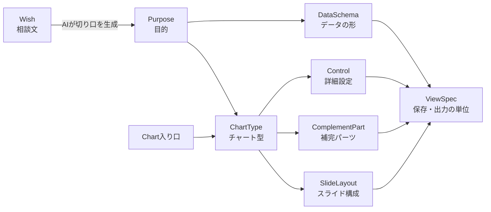

# Chart Advisor チャートレジストリ設計書 v1

2026-09-23 時点。原本は claude.ai 上の Claude Doc。この Markdown はそのエクスポート（リポジトリ内の正本として扱う）。

## 目的と統合方針

Web版は、画面・描画・保存・AI・PPT出力のすべてを1つの「チャートレジストリ」から動かす。この設計書はその初版で、NarratiXのハンドオフ資料（6目的・17チャート・設定一覧、`docs/narratix-handoff.md`）と、Chart Advisorで検討した新要素（Wishの入り口、補完パーツ、スライド構成、2時点比較）を統合したものである。

統合の原則は次の4つ。

- **データは目的ごとに1つ、見せ方は複数**：NarratiXのデータスキーマの考え方を継承し、同じ目的の中ではデータを入れ直さずにチャートを切り替えられる。
- **3つの入り口、1つの中身**：Wish・目的・Chartのどこから入っても、最終的には同じ形式（ViewSpec）の設定に行き着き、同じビルダーとPPT出力を通る。
- **AIは設定を作るだけ**：Wishの入り口でAIが返すのはViewSpecのJSONのみ。描画・計算・出力はプログラムが担い、品質とコストを安定させる。
- **チャートの弱点は補完パーツで埋める**：各チャートは「見せられるもの・見せられないもの」を持ち、足りない要素を補完パーツで補う。

表記：「既存」はNarratiXのコードに存在するもの、「新規」はWeb版で追加するもの、「要確認」はバックエンドのコードで挙動を確かめる必要があるもの。

## 全体構造

レジストリは7つのエンティティで構成する。うち4つはNarratiXの資料から引き継ぎ、3つ（ComplementPart、SlideLayout、ViewSpec）を新規に追加する。



Wishは Purpose の手前に入り、目的から入る人は Purpose から、チャートが決まっている人は ChartType から入る。どの経路でも最後は ViewSpec に集約される。

| エンティティ | 役割 | 出どころ |
| --- | --- | --- |
| DataSchema | 入力データの形（表の構造、必須項目、比較期間の有無） | 既存（5種）＋新規拡張 |
| Purpose | 分析の目的と、ユーザーの問い | 既存（6種） |
| ChartType | チャート型、必要データ、見せられる要素、描画・出力方式 | 既存（17種）＋新規 |
| Control | チャートごとの詳細設定 | 既存 |
| ComplementPart | チャートの外に足す部品（揃えた表、増減ラベルなど） | 新規 |
| SlideLayout | 1枚のパネル配置（8パターン、最大4分割）と比率、データ変換、パネル同士の揃え | 新規 |
| ViewSpec | データ＋レイアウト＋パネル（チャート・表・テキスト）の組み合わせ。保存・バージョン・AI出力・PPT出力の共通形式 | 新規 |

## DataSchema：データの形

既存の5スキーマをそのまま採用し、全スキーマ共通で「比較期間（base）」を任意で持てるように拡張する。比較期間があると、成長率、構成比の変化（pt）、ポジションの移動などの補完パーツが使えるようになる。

| ID | 構造 | 主な用途 | Web版での拡張 |
| --- | --- | --- | --- |
| MATRIX_TIME_SERIES | 行＝項目（期間またはカテゴリ）× 列＝系列、値は数値 | Trend、Comparison | 積み上げ・100%積み上げ・スロープでも使う |
| MEKKO | 行＝カテゴリ（地域など）× 列＝セグメント（形状など）、値は実数 | Composition | 比較期間の同形マトリクスを任意で追加（成長率表・pt表示に必要） |
| DRIVER_BRIDGE | 始点値、終点値、要因リスト（名前・値） | Contribution | 始点・終点のラベル入力を追加（既存は入力欄が欠落） |
| BUBBLE | 項目ごとにX、Y、サイズ（任意）、グループ（任意） | Relationship | 比較期間のX・Yを任意で追加（軌跡矢印に必要） |
| EVALUATION | 行＝項目 × 列＝指標、指標ごとに方向（高い方が良い／低い方が良い）と単位 | Evaluate | 変更なし |

値は常に実数で入力し、構成比や成長率はアプリ側で計算する（ユーザーに率を手計算させない）。

```typescript
interface Dataset {
  schema: 'MATRIX_TIME_SERIES' | 'MEKKO' | 'DRIVER_BRIDGE' | 'BUBBLE' | 'EVALUATION';
  unit?: string;                    // 例: 百万ドル
  numberFormat?: 'auto' | 'raw' | 'K' | 'M' | '%';
  rows: string[];                   // 項目・カテゴリ名
  cols: string[];                   // 系列・セグメント・指標名
  periods: {
    current: { label: string; values: (number | null)[][] };
    base?:   { label: string; values: (number | null)[][] };  // 任意。同じ rows×cols
  };
  colMeta?: { direction?: 'higher' | 'lower'; unit?: string }[]; // EVALUATION用
  bridge?: { startLabel: string; start: number; endLabel: string; end: number }; // DRIVER_BRIDGE用
}
```

検証ルールの初期案：比較期間の値が空または0のセルは成長率を「—」とし、警告を出す。現在と比較の期間が同じ、または逆転している場合は、CAGRを使わず期間の伸び率に切り替える。これらは `reference/mekko-builder.html` で実装済みの挙動に合わせている。

## Purpose：目的

6つの目的をすべてローンチ対象とする。Evaluateは既存コードでは隠れていたが、「どこで何が伸びているか」を一望するヒートマップが切り口の提案で頻繁に使われるため、表に出す。

| ID | ユーザーの問い | DataSchema | 所属チャート | Wishでよく出る言い回し |
| --- | --- | --- | --- | --- |
| trend | 時間とともにどう変わったか | MATRIX_TIME_SERIES | 折れ線、縦棒、横棒、積み上げ棒（新規）、100%積み上げ棒（新規）、スロープ（新規） | 推移を見せたい、伸びている、減っている |
| comparison | 項目間でどう違うか、どれが上位か | MATRIX_TIME_SERIES | 横棒、縦棒、集合縦棒、差分バー | 比べたい、ランキング、予算と実績の差 |
| composition | 全体の大きさと、その内訳は | MEKKO | Mekko、100%横棒（新規） | シェア、構成、誰がどれだけ取っているか |
| contribution | 始点から終点への変化は何によるか | DRIVER_BRIDGE | ウォーターフォール、要因バー、プラス・マイナスバー | なぜ増えた・減った、要因を分解したい |
| relationship | 2つの指標はどう関係するか、どこに位置するか | BUBBLE | 散布図、バブル | 相関、ポジショニング、狙い所 |
| evaluate | 複数の指標で見てどうか | EVALUATION | ヒートマップ、小さな棒の並び、指標別ランキング | 総合評価、強み・弱み、一覧で見たい |

Wishの入り口では、AIが相談文から複数の切り口（仮説またはメッセージ）を作り、切り口ごとに Purpose を1つ割り当てる。エアフライヤーの例では、同じ相談から trend（全地域で移行が進む）、evaluate（地域で速さが違う）、composition（大市場が成長を牽引）の3つの切り口が生まれる。

注意点として、切り口ごとに Purpose が違うと DataSchema も変わりうる。エアフライヤーの例では MEKKO スキーマに比較期間を入れれば3つとも描けるため、Wishの提案時は「1回のデータ入力で最も多くの切り口を描けるスキーマ」を推奨する。

## ChartType：チャート型

ローンチ対象は20種（既存16種＋新規4種）。既存の「Scatter＋Quadrants」は独立したチャート型にせず、散布図とバブルの補完パーツ「象限」に統合する。

| ID | チャート | 目的 | 見せられる | 見せられない | 推奨補完 | 標準出力 |
| --- | --- | --- | --- | --- | --- | --- |
| line | 折れ線 | trend | 推移、傾き、転換点 | 内訳、変化の理由 | cagr_note, callout, reference_line | 図形 |
| column_trend | 縦棒 | trend | 期間ごとの大きさ | 変化率 | delta_labels, cagr_note | 図形 |
| bar_trend | 横棒 | trend | 期間ごとの大きさ（ラベルが長い場合） | 変化率 | delta_labels | 図形 |
| stacked_column | 積み上げ縦棒（新規） | trend | 合計の推移と内訳 | 内訳ごとの成長率 | total_labels, cagr_note, aligned_table | 図形 |
| stacked_100 | 100%積み上げ縦棒（新規） | trend | 構成比の変化 | 規模 | total_labels, delta_labels | 図形 |
| slope | スロープ（新規） | trend | 2時点の変化の向き、順位の入れ替わり | 途中の推移、規模 | aligned_table | 図形 |
| bar_rank | 横棒ランキング | comparison | 順位、大小 | 変化、成長 | aligned_table, reference_line, rank_change | 図形 |
| column_compare | 縦棒比較 | comparison | 大小 | 変化 | reference_line, aligned_table | 図形 |
| clustered_column | 集合縦棒 | comparison | 2対象の並列比較 | 差の意味 | delta_labels, insight_box | 図形 |
| variance_bar | 差分バー | comparison | 差の大きさと向き | 絶対水準 | aligned_table | 図形 |
| mekko | Mekko | composition | 規模と構成 | 成長率、時系列の変化 | aligned_table, delta_labels, cagr_note | 図形（実装済み） |
| bar_100 | 100%横棒（新規） | composition | 対象間の構成の違い | 各対象の規模 | aligned_table, total_labels | 図形 |
| waterfall | ウォーターフォール | contribution | 要因ごとの寄与 | 各要因の率、背景 | aligned_table, callout, insight_box | 図形 |
| driver_bar | 要因バー | contribution | 要因の大きさと向き | 始点・終点の水準 | insight_box | 図形 |
| posneg_bar | プラス・マイナスバー | contribution | 増加要因と減少要因の対比 | 正味の変化 | reference_line, insight_box | 図形 |
| scatter | 散布図 | relationship | 相関、外れ値 | 規模、時間 | quadrants, reference_line, trajectory | 図形 |
| bubble | バブル | relationship | 3指標の位置関係 | 時間の変化 | quadrants, trajectory | 図形 |
| heatmap | ヒートマップ表 | evaluate | 2軸の全体像 | 規模 | aligned_table, sparkline | 表 |
| small_multiples_bar | 小さな棒の並び | evaluate | 指標ごとの順位 | 総合評価 | reference_line, insight_box | 図形 |
| leaderboard | 指標別ランキング | evaluate | 最良・最悪の把握 | 差の大きさ | sparkline, rank_change | 表 |

標準出力は、どの方式でPPTに出すかの既定値である。追加の選択肢とチャートごとの対応は「出力方式」の章で定義する。

各チャートのレジストリ定義は次の形をとる（Mekkoの例）。

```json
{
  "id": "mekko",
  "purpose": "composition",
  "schema": "MEKKO",
  "label": { "ja": "Mekko", "en": "Mekko" },
  "shows": ["size", "mix", "regional_difference"],
  "cannotShow": ["growth", "time_change"],
  "complements": ["aligned_table", "delta_labels", "cagr_note"],
  "controls": ["items", "series", "highlight", "mekko_labels", "sort_by_size"],
  "requires": { "base": false },
  "renderer": "mekko",
  "exports": ["shapes", "svg", "png"],
  "defaultExport": "shapes",
  "messageExamples": {
    "ja": ["大きい市場でどの形状が取れているか見せたい", "市場規模とシェアを一枚で"],
    "en": ["Show which segments win in the largest markets", "Market size and share on one slide"]
  }
}
```

今回の対象外（将来候補）：ツリーマップ、ダンベル、目標対実績（ブレット）、KPIツリー、ヒストグラム・箱ひげ、ファネル。

## Control：詳細設定

設定は目的単位ではなくチャート単位で適用先を明示する。画面には、選んだチャートに効く設定だけを表示する。

| ID | 設定 | 選択肢 | 適用チャート | 状態 |
| --- | --- | --- | --- | --- |
| title / subtitle / source | タイトル（メッセージ）、サブタイトル、出典 | 自由入力 | 全チャート | 既存 |
| unit / number_format | 単位、数値の表記 | 自動、そのまま、K、M、% | 全チャート | 既存（Relationshipは隠れていた→表示する） |
| axis_swap | 行と列のどちらを横軸にするか | 通常、入れ替え | trend、comparison、relationship | 既存 |
| items / series | 表示する項目・系列の絞り込み | データから生成 | 全チャート | 既存 |
| highlight | 強調する系列・項目（他はグレー） | データから生成 | 全チャート | 既存 |
| gridlines | 目盛線 | なし、薄く、あり | 棒・折れ線・散布図系 | 既存 |
| data_labels | 値ラベル | なし、すべて | 棒・折れ線・散布図系 | 既存 |
| line_markers | 折れ線のマーカー | あり、なし | line | 既存 |
| compare_target | 比較の対象 | データから生成 | bar_rank、column_compare | 既存 |
| rank_sort | 並び順 | 降順、昇順 | bar_rank、column_compare | 既存 |
| base_target / compare_target2 | 差分の基準と比較先 | データから生成 | clustered_column、variance_bar | 既存 |
| variance_sort | 差の並び順 | 降順、昇順 | clustered_column、variance_bar | 既存 |
| mekko_labels | Mekkoのラベル表示 | %のみ、実数（%）、実数のみ、なし | mekko | 既存 |
| sort_by_size | 規模の大きい順に並べる | オン、オフ | mekko、bar_100 | 新規（ビルダー実装済み） |
| driver_sort | 要因の並び順 | 影響の大きい順・小さい順、入力順、プラス優先、マイナス優先、任意 | waterfall、driver_bar、posneg_bar | 既存 |
| show_zero | 値0の要因を表示 | オン、オフ | contribution系 | 既存 |
| mismatch | 要因の合計が終点と合わない時 | 調整項目を追加、終点を自動補正 | contribution系 | 既存 |
| connectors | ウォーターフォールの連結線 | オン、オフ | waterfall | 既存 |
| posneg_color | プラス・マイナスの色 | 標準、モノクロ、高コントラスト | contribution系 | 既存 |
| bubble_size | バブルの大きさ | 自動、固定スケール | bubble | 既存 |
| color_scale | 色の濃淡の基準 | 列ごと、行ごと、表全体 | heatmap | 既存（隠れ） |
| direction | 指標の向き | 高い方が良い、低い方が良い | evaluate系 | 既存（隠れ） |
| item_sort / metric_sort | 項目・指標内の並び順 | 入力順、平均の高い順・低い順、降順、昇順 | evaluate系 | 既存（隠れ） |
| orientation | 小さな棒の向き | 横、縦 | small_multiples_bar | 既存（隠れ） |
| palette | 配色 | 標準、モノクロ、高コントラスト、会社のブランド色 | 全チャート | 既存を拡張（ブランド色は新規） |

象限の表示と分割基準（中央値、平均、手入力）は、既存では設定項目だったが、補完パーツ「quadrants」に移す。挙動は同じで、置き場所だけが変わる。

## ComplementPart：補完パーツ

補完パーツは、チャートの「見せられない要素」を埋めるための部品で、12種を定義する。画面では、チャートの弱点の横に「＋追加」として提案し、ワンクリックで反映する（既存のAdviceの文章案内を、この操作に置き換える）。

| ID | 部品 | 補う要素 | 比較期間が必要 | 主な適用チャート |
| --- | --- | --- | --- | --- |
| aligned_table | 列幅・行位置をチャートに揃えた表 | 成長率、規模など第3の指標 | 成長率を出す場合は必要 | mekko、stacked_column、bar_rank、heatmap ほか |
| delta_labels | 増減ラベル（+18pt、+12%） | 変化の大きさ | 必要 | mekko、stacked_100、clustered_column |
| cagr_note | 系列の端にCAGRを1つ添える | 期間の成長率 | 必要 | line、stacked_column、mekko |
| total_labels | 棒の上に合計値 | 構成比チャートでの規模 | 不要 | stacked_100、bar_100、stacked_column |
| reference_line | 平均・目標・前年の参照線 | 良し悪しの基準 | 前年の場合は必要 | line、bar_rank、scatter ほか |
| insight_box | 右側の示唆ボックス | 解釈、次のアクション | 不要 | contribution系、clustered_column |
| callout | 吹き出しの注釈 | 変化の理由（出来事） | 不要 | line、waterfall |
| sparkline | 表内のミニ推移線 | 静止図の時間軸 | 3時点以上が必要 | heatmap、leaderboard |
| rank_change | 順位変化の記号（↑2、↓1） | ランキングの変化 | 必要 | bar_rank、leaderboard |
| quadrants | 象限と分割線（中央値・平均・手入力） | 位置の意味づけ | 不要 | scatter、bubble |
| trajectory | 比較期間の位置からの矢印 | ポジションの時間変化 | 必要 | scatter、bubble |
| small_multiples | 同じ軸の小さなチャートに分割 | 系列が多すぎて読めない問題 | 不要 | line、stacked_100 |

`requiresBase` が真の部品は、比較期間のデータがない場合に「比較年のデータを入れると使えます」と案内する。

```json
{
  "id": "aligned_table",
  "label": { "ja": "揃えた表", "en": "Aligned table" },
  "covers": ["growth", "size"],
  "appliesTo": ["mekko", "stacked_column", "bar_rank", "heatmap"],
  "requiresBase": "when_growth",
  "options": { "rows": ["market_growth", "series_growth"], "growthMode": ["cagr", "period"] },
  "suggestText": { "ja": "{gap}が見えません。下に列幅を揃えた表を足すと解決します。" }
}
```

推薦ロジックは、ユーザーが見せたい要素（規模、成長、構成、時間、理由など）とチャートの `shows` を突き合わせ、足りない要素を `covers` に持つ部品を提案する。

## SlideLayoutとViewSpec

1枚のスライドは「パネルの集まり」として定義する。パネルはチャート・表・テキスト（示唆ボックス）のいずれかで、最大4つまで。すべてのパネルは同じデータセットを参照し、必要に応じてデータ変換（transform）で別の見方を作る。これにより「データ入力は1回、1枚に複数の図」が実現でき、実装は1パネルから始めても、保存形式を変えずに後から3分割・4分割へ広げられる。

### レイアウトのひな形（8パターン）

パターンは `docs/layouts.pdf` のレイアウト仕様に準拠する。自由配置にはせず、ひな形＋比率の調整に限定して、崩れを防ぎPPTでも同じ位置関係を保つ。

| ID | パネル数 | 配置 | 既定の比率 | 主な使いどころ |
| --- | --- | --- | --- | --- |
| p01_single | 1 | 全面 | — | 最重要メッセージを1つの図で |
| p02_top_bottom | 2 | 上下 | 1:1 | 前年と今年、原因と結果 |
| p03_left_right | 2 | 左右 | 1:1（3:1で「チャート＋示唆ボックス」） | A/B比較、2指標、結論の言い切り |
| p04_three_columns | 3 | 横に3等分 | 1:1:1 | 3ステップ、3つの柱 |
| p05_left_main_bottom | 3 | 左 ＋ 右上の主チャート ＋ 右下の表 | 左1/3、右は上下3:1 | 全体像＋内訳＋補足表（Mekkoの複合構成） |
| p06_main_top_two_bottom | 3 | 上の主チャート ＋ 下に2つ | 上下1:1、下は1:1 | 全体サマリーと2つの内訳 |
| p07_two_top_conclusion | 3 | 上に2つ ＋ 下の結論 | 上下1:1、上は1:1 | 前提2つから結論を導く |
| p08_grid_2x2 | 4 | 2×2 | 均等 | SWOT、4つの独立した要素 |

比率は既定値を持ちつつ、範囲内で調整できるようにする。たとえば p05 で左に全地域合計の100%積み上げ棒（2本）を置く場合、左の幅は1/6程度が適切なため、左の幅を1/6〜1/2の範囲で変えられるようにする。スライドのタイトル（メッセージ）と出典の領域は全パターン共通で確保し、パネル内のテキストは最小限にする。複数枚のストーリー（全体像 → 深掘り → 示唆の3枚など）は、ViewSpecを複数並べた「デッキ」として別に扱う。

### データ変換（transform）

| ID | 内容 | 例 |
| --- | --- | --- |
| aggregate_rows | 行を合計して1行にする | 全地域合計の構成比 |
| select_periods | 使う期間を選ぶ（比較・現在・両方） | 2021年と2025年の2本を並べる |
| growth | 比較期間からの成長率を計算（CAGR／期間） | 成長率表、ヒートマップ |
| share | 行内の構成比に変換 | 100%積み上げ |
| delta_share | 構成比の変化（pt） | 増減ラベル |
| filter / sort | 項目の絞り込みと並び替え | 上位5地域のみ、規模順 |

### パネル同士の揃え（align）

| 揃え | 内容 | 例 |
| --- | --- | --- |
| columns | 列の位置と幅を揃える | Mekkoの下の成長率表 |
| rows | 行の位置と高さを揃える | 横棒ランキングの右の詳細表 |
| y_scale | 縦軸の目盛を揃える | 左の合計棒とMekkoの0〜100% |
| x_scale | 横軸の目盛を揃える | 上下に並べた2つの推移チャート |
| palette | 系列の色を揃える（既定で常に有効） | 全パネルで「デュアル」は同じ色 |

**補完パーツとの関係**：補完パーツのうち、チャートの外に置くもの（揃えた表、示唆ボックス）は、実体としては「揃えの指定を持ったパネル」になる。補完パーツは「よく使うパネルの組み合わせをワンクリックで足す近道」と位置づけ、追加するとレイアウトが自動で切り替わる（例：Mekkoに揃えた表を足すと p01 から p05 の右側構成へ）。チャートの中に描くもの（増減ラベル、象限、軌跡など）は、パネル内のオプションとして扱う。

### ViewSpec の型

```typescript
interface ViewSpec {
  id: string;
  version: number;
  datasetId: string;                 // データは1つ、ViewSpecは複数
  angle?: { kind: 'hypothesis' | 'message'; text: string };
  layout: { id: string; ratios?: number[] };  // 例: { id: 'p05_left_main_bottom', ratios: [1/6, 3/4] }
  panels: Panel[];                   // 1〜4個。最初の実装は1個で可
  slide: { title: string; subtitle?: string; source?: string };
  slideLocale: Locale;
  palette?: string;
  export?: string;                   // 出力方式。未指定ならチャートの標準
}

interface Panel {
  id: string;
  slot: string;                      // レイアウト内の位置（'main' | 'left' | 'bottom' など）
  kind: 'chart' | 'table' | 'text';
  chart?: string;                    // ChartType.id（kind が chart の場合）
  table?: string;                    // 表の種類（growth_table、data_table など）
  purpose?: string;
  transform?: Transform[];
  controls?: Record<string, unknown>;
  inChartComplements?: { id: string; options?: Record<string, unknown> }[];
  align?: { to: string; axis: 'columns' | 'rows' | 'y_scale' | 'x_scale' }[];
  text?: string;                     // kind が text の場合（示唆ボックス）
}
```

### 例：Mekkoの複合構成（p05）

```json
{
  "datasetId": "airfryer_region_shape",
  "angle": { "kind": "hypothesis", "text": "成長の大半は、大きな市場のデュアルが生んでいる" },
  "layout": { "id": "p05_left_main_bottom", "ratios": [0.17, 0.75] },
  "panels": [
    { "id": "total", "slot": "left", "kind": "chart", "chart": "stacked_100",
      "transform": [{ "type": "aggregate_rows" }, { "type": "select_periods", "periods": ["base", "current"] }],
      "align": [{ "to": "main", "axis": "y_scale" }] },
    { "id": "main", "slot": "main", "kind": "chart", "chart": "mekko",
      "controls": { "mekko_labels": "pct", "sort_by_size": true },
      "inChartComplements": [{ "id": "delta_labels" }] },
    { "id": "growth", "slot": "bottom", "kind": "table", "table": "growth_table",
      "transform": [{ "type": "growth", "mode": "cagr", "rows": ["market", "series:デュアル"] }],
      "align": [{ "to": "main", "axis": "columns" }] }
  ],
  "slide": { "title": "[メッセージ：データ入力後に確定]", "source": "[データ出典]" },
  "slideLocale": "ja"
}
```

左の合計棒が「全体ではデュアルへの移行が進んだ」、中央のMekkoが「地域ごとの違い」、下の表が「成長率」を担い、1枚で全体 → 内訳 → 成長の順に読める。AIに返させるのはこの形だけで、存在しないチャート・表・変換のIDや、レイアウトのパネル数を超える指定はレジストリで検証して弾く。

## 出力方式

標準の出力は「図形で組む」とする。画面のプレビューと同じ配置計算からPPTを作るため、見た目がプレビューと一致し、文字・色・位置はPowerPointでそのまま直せる。ネイティブのグラフは、2段ラベル、ラベルの重なり回避、揃えた表との位置合わせ、注釈などを表現できず、見た目の品質が落ちやすいため標準にはしない。

| ID | 出力方式 | 見た目 | 編集できる範囲 | 位置づけ |
| --- | --- | --- | --- | --- |
| shapes | 図形で組む | プレビューと同一 | 文字・色・位置（データは連動しない） | 標準（全チャート） |
| native | PowerPointのグラフ | 出力時に書式を指定して整える | データごと編集できる | 選択式（単純な型のみ） |
| table | PowerPointの表 | プレビューと同一 | 値・色・文字 | 表形式のチャートの標準 |
| svg | SVG画像 | プレビューと同一、拡大しても鮮明 | PowerPoint 365では図形に変換可能 | 選択式（全チャート） |
| png | 高解像度PNG画像 | プレビューと同一 | 編集不可 | 選択式（貼り付け用） |
| thinkcell | think-cell用データ | think-cellの標準 | think-cellで自在に編集 | 将来オプション（利用者側にライセンスが必要） |

ユーザーには出力時に「見た目優先（標準）」「データ編集優先」「画像」の3択で見せ、内部で上の方式に対応させる。「データ編集優先」は native に対応するチャートでのみ表示する。

```json
{ "id": "line", "exports": ["shapes", "native", "svg", "png"], "defaultExport": "shapes" }
```

| チャート | 標準 | 追加で選べる方式 |
| --- | --- | --- |
| line、column_trend、bar_trend、stacked_column、stacked_100、slope | shapes | native、svg、png |
| bar_rank、column_compare、clustered_column、bar_100 | shapes | native、svg、png |
| variance_bar | shapes | native（要確認）、svg、png |
| waterfall、driver_bar、posneg_bar | shapes | native、svg、png |
| scatter、bubble | shapes | native、svg、png |
| mekko、small_multiples_bar | shapes | svg、png |
| heatmap、leaderboard | table | svg、png |

補完パーツ（揃えた表、示唆ボックス、注釈など）は、どの出力方式でも図形または表として別途配置する。native を選んだ場合も、チャート本体だけがグラフになり、補完パーツの見た目は変わらない。think-cell のデータ連携の仕様は実装前に確認する。

## 多言語対応

ローンチ時は日本語と英語を切り替えられるようにし、言語の追加はコードを変えずに「翻訳ファイルとフォント設定を足すだけ」で済む構造にする。NarratiXにはすでに日英のUI文言があるため、翻訳の土台として再利用する。

| 層 | 例 | 扱い |
| --- | --- | --- |
| 画面の文言 | ボタン、見出し、エラー、案内文 | キーで管理する翻訳ファイル（言語ごとに1ファイル） |
| レジストリの表示名と説明 | チャート名、目的の問い、補完パーツの提案文、相談文の例 | レジストリ内に言語別の値を持つ。IDは言語に依存しない英字で固定 |
| ユーザーのコンテンツ | データの項目名、スライドのメッセージ、出典 | 翻訳しない。入力された言語のまま扱う |

```typescript
type Locale = 'ja' | 'en';            // 将来 'zh' | 'ko' などを追加
type LocalizedText = Partial<Record<Locale, string>> & { en: string }; // 英語を必須の予備とする

interface ChartType {
  id: string;                          // 例: "mekko"（全言語共通）
  label: LocalizedText;
  messageExamples: Partial<Record<Locale, string[]>>;
  // …
}

interface ViewSpec {
  // …
  slideLocale: Locale;                 // スライドに自動で入る文言の言語
}
```

- **画面の言語とスライドの言語を分ける**：日本語の画面で英語の資料を作るケースは多い。スライドに自動で入る文言（凡例の注記、表の行名「市場全体 CAGR」、単位の注記、「出典：」の接頭辞など）は `slideLocale` に従う。
- **数値と単位の表記**：桁区切りや小数点は言語に合わせる。日本語では K・M に加えて「万・億」の単位表記を選べるようにする。
- **フォント**：PPT出力のフォントは言語ごとに既定を持つ（日本語はメイリオまたは游ゴシック、英語は Arial など、社内規定に合わせて変更可能）。ラベル幅の見積もりも文字種ごとに行う。
- **画面の作り**：英語は文字列が長くなりやすいため、ボタンや見出しの幅を固定しない。
- **Wishの入り口**：相談文はどの言語でもよく、AIは画面の言語で切り口を返す。`messageExamples` は言語ごとに用意する。

## 未決事項と次のアクション

### この版で仮決めしたこと（変更可）

- Evaluate はローンチ対象に含める。
- Scatter＋Quadrants は独立チャートにせず、補完パーツ quadrants に統合する。
- 複数チャートは「比較の段階では並べて表示、調整は1つずつ」とする。
- 最初に端から端まで通すのは Composition（Mekko＋揃えた表）とし、次に Trend と Comparison を載せる。

### 確認が必要なこと

- [ ] バックエンドのコード：計算、検証、インサイト、Adviceの生成ルール（推測で再実装しない）
- [ ] 差分バーの実装方式と、MEKKOスキーマの既存の計算（幅と構成比の算出方法）
- [ ] スキーマごとのサンプルデータと、チャートごとの初期設定値
- [ ] 色のルール：標準パレット、強調色、プラス・マイナス色、ブランド色を登録可能にするか
- [ ] Googleスライドへの出力と既存デッキへの追記を、Web版でも残すか（PPTXのみにするか）
- [ ] トライアル・ベータの利用制限ロジックの扱い（描画機能とは切り離し、課金側で管理する）
- [ ] think-cell のデータ連携の仕様（将来オプションとして実現できるか）
- [ ] 翻訳の担当と品質確認の方法

### 次のアクション

1. この設計書の仮決め事項を確定する。
2. レジストリを型付きファイルとして書き起こし、20チャートと12補完パーツ、8レイアウト、変換をすべて定義する。
3. Composition（Mekko）を、レジストリから動く形にビルダーを作り替えて検証する。
4. Trend と Comparison を同じ仕組みに載せる。
